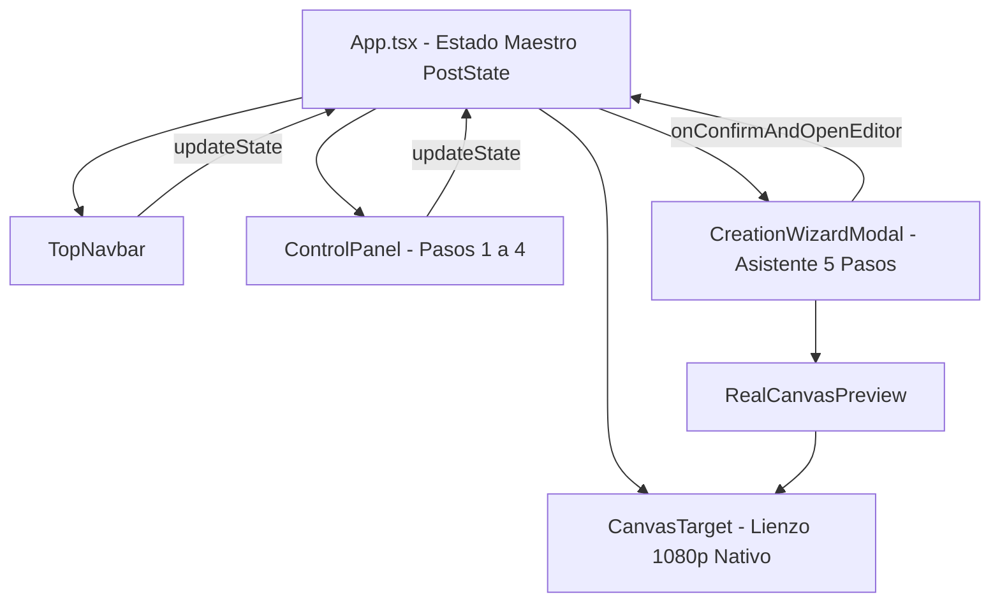
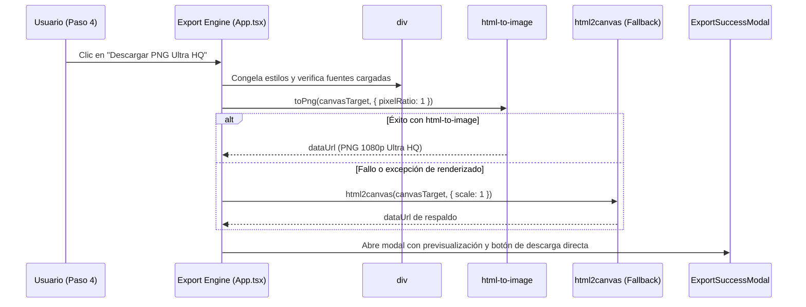

# 🏛️ Arquitectura Técnica y Mapa de Código — Media Studio v1.1

> **Documento Canónico de Ingeniería y Flujo de Datos**  
> *Repositorio*: `aleric-dev/generate-media`  
> *Versión del Software*: **v1.1**  
> *Objetivo*: Proveer un mapa integral de la arquitectura del código, ciclo de vida del estado, pipeline de renderizado y guías prácticas para acelerar el desarrollo de nuevas funcionalidades.

---

## 1. Visión General y Filosofía de Arquitectura

**Media Studio** es una estación de trabajo editorial y generador de gráficos técnicos para redes sociales concebido con tres principios no negociables:

1. **Fidelidad Nativa 1080p Ultra HQ**: Todo diseño se procesa en un plano nativo de 1080 píxeles de ancho (o 1920 en 16:9). Lo que el usuario previsualiza en el canvas es exactamente idéntico al bitmap final exportado.
2. **Cero Dependencia de Servidor para Renderizado**: La exportación corre 100% en el cliente (Browser Edge) mediante clonación SVG con `html-to-image` y fallback a `html2canvas`.
3. **Estado Predecible y Centralizado**: El post se describe completamente mediante un único objeto inmutable tipado (`PostState`), permitiendo serializar, persistir marcas, restaurar plantillas y compartir configuraciones sin dispersión de estado.

---

## 2. Mapa Integral de Archivos y Componentes

```text
generate-media/
├── AGENTS.md                                # Directrices operativas para asistentes de IA
├── index.html                               # Punto de montaje HTML y Google Fonts preloaded
├── package.json                             # React 19, Vite 6, Tailwind v3, html-to-image, Lucide
├── DOCS/                                    # Centro de Documentación Oficial
│   ├── index.md                             # Índice maestro
│   ├── 1-guia-de-uso-y-flujo-de-la-aplicacion.md
│   ├── 2-despliegue-en-cloudflare.md
│   ├── 3-publico-objetivo-y-casos-de-uso.md
│   ├── 4-roadmap-e-ideas-a-futuro-v2.md
│   └── 5-arquitectura-tecnica-y-mapa-de-codigo.md # [Este documento]
├── src/
│   ├── types.ts                             # Tipado maestro de TypeScript (PostState, BrandProfile, etc.)
│   ├── App.tsx                              # Orquestador del estado global, enrutador SPA y exportación
│   ├── main.tsx                             # Montaje de React 19 en #root
│   ├── index.css                            # Clases utilitarias de Tailwind y animaciones de página
│   ├── constants/
│   │   ├── logos.ts                         # Directorio de rutas de logos oficiales y genéricos
│   │   └── templates.ts                     # 24 plantillas tipadas y catálogo de aspect ratios
│   ├── utils/
│   │   └── brandStorage.ts                  # Persistencia en localStorage de marcas recurrentes
│   ├── styles/
│   │   └── patterns.css                     # 11 tramas algorítmicas CSS, viñetas y gradientes
│   └── components/
│       ├── LandingScreen.tsx                # Landing comercial introductoria con llamadas a la acción
│       ├── WelcomeScreen.tsx                # Menú modal de bienvenida (Empezar de 0 vs Plantilla vs Asistente)
│       ├── CreationWizardModal.tsx          # Asistente guiado de 5 pasos con guardado de marca
│       ├── RealCanvasPreview.tsx            # Viewport responsive con auto-escalado pixel-perfect
│       ├── PageTransitionLoader.tsx         # Loader visual con barra de progreso entre pantallas
│       ├── TopNavbar.tsx                    # Barra superior (Zoom, Selector de Ratio, Deshacer, Vistas)
│       ├── TemplatesModal.tsx               # Catálogo modal de 24 plantillas categorizadas
│       ├── ExportSuccessModal.tsx           # Modal de previsualización y confirmación de descarga Ultra HQ
│       ├── Canvas/
│       │   └── CanvasTarget.tsx             # Lienzo 1080p nativo con 9 módulos centrales y capas de fondo
│       └── Panel/
│           ├── ControlPanel.tsx             # Panel lateral con pestañas 1-4 en cabecera
│           ├── AccordionSection.tsx         # Contenedor colapsable con micro-animaciones
│           ├── Step1Content.tsx             # Paso 1: Títulos, módulos centrales, espaciados y footer
│           ├── Step2Style.tsx               # Paso 2: Branding, monogramas, fuentes y formas
│           ├── Step3Background.tsx          # Paso 3: Colores, tramas, viñetas, luces y orden de capas
│           └── Step4Export.tsx              # Paso 4: Ratios, formato de imagen y botón Ultra HQ
```

---

## 3. Ciclo de Vida del Estado Global (`PostState`)

Toda la aplicación gravita alrededor del objeto `PostState` definido en [`src/types.ts`](../src/types.ts).

### Flujo Unidireccional de Datos



* **Inmutabilidad y Actualizaciones Parciales**: Todas las mutaciones se ejecutan mediante:
  ```typescript
  const updateState = (partial: Partial<PostState>) => {
    setState((prev) => ({ ...prev, ...partial }));
  };
  ```
* **Enrutamiento SPA Ligero sin Dependencias**:
  `App.tsx` lee y sincroniza `window.location.pathname` para alternar entre tres vistas:
  1. `'landing'`: Presentación comercial y onboarding (`LandingScreen`).
  2. `'welcome'`: Menú central de decisiones (`WelcomeScreen`).
  3. `'editor'`: Suite editorial completa con panel lateral y mesa de trabajo (`ControlPanel` + `CanvasTarget`).

---

## 4. El Motor de Canvas 1080p Ultra HQ (`CanvasTarget.tsx`)

`CanvasTarget` es el núcleo gráfico del estudio. Sus características fundamentales:

### Dimensiones Nativas por Ratio
```typescript
export const aspectRatios: Record<AspectRatioKey, AspectRatioConfig> = {
  '4:5':  { nativeW: 1080, nativeH: 1350, px: '1080 × 1350 px', label: 'Instagram 4:5' },
  '1:1':  { nativeW: 1080, nativeH: 1080, px: '1080 × 1080 px', label: 'Post 1:1' },
  '9:16': { nativeW: 1080, nativeH: 1920, px: '1080 × 1920 px', label: 'Story/Reel 9:16' },
  '16:9': { nativeW: 1920, nativeH: 1080, px: '1920 × 1080 px', label: 'Banner 16:9' },
};
```

### Arquitectura de Capas de Fondo (`BackgroundLayerOrder`)
El fondo se compone de 4 estratos configurables mediante `state.backgroundLayerOrder`:
1. **Patrón Tecnológico (`pattern`)**: Tramas algorítmicas SVG/CSS definidas en `patterns.css` (circuit, neural, matrix, grid, hexagons, dots, etc.).
2. **Luces Ambientales (`lights`)**: Gradientes radiales y elípticos (`spotlight`, `aurora`, `glow`, `dual-beams`).
3. **Formas Procedimentales (`shapes`)**: Elementos geométricos decorativos (orbes de vidrio, diamantes, corchetes de código).
4. **Viñeta de Profundidad (`vignette`)**: Máscaras radiales y degradados perimetrales.

---

## 5. Previsualización Real en el Asistente (`RealCanvasPreview.tsx`)

A diferencia de versiones anteriores que usaban mockups esquemáticos, el Wizard utiliza ahora `RealCanvasPreview`.

* **Principio de Auto-Escalado Responsive**:
  El componente monta `<CanvasTarget state={state} />` a resolución nativa completa (1080x1350) pero contenido dentro de un `transform: scale(scaleFactor)` dinámico calculado mediante un `ResizeObserver`.
* **Beneficio**: Garantiza que el usuario ve **exactamente la misma tipografía, saltos de línea, contrastes y proporciones** que tendrá en el editor final.

---

## 6. Los 9 Módulos Centrales Optimizados

Media Studio v1.1 incluye 9 casos de módulos centrales diseñados para máxima conversión:

| Módulo (`activeModule`) | Componente Visual | Elementos Clave |
| :--- | :--- | :--- |
| **`code`** | Ventana IDE macOS | Semáforo de 3 botones (rojo, amarillo, verde), pestaña de archivo con icono de lenguaje, números de línea en columna izquierda y sintaxis tipada. |
| **`kpi`** | Tarjetas de Métricas Glass | Números monospace gigantes, top-border en `currentColor`, halo perimetral y badges de tendencia (▲ Crecimiento / ▼ Reducción). |
| **`chart`** | Suite Gráfica (3 Tipos) | **Barras horizontales** con riel interior y brillo neón; **Donut/Pie** circular SVG con badge central ("Líder"); **Líneas** con curva de área degradada y tooltips flotantes. |
| **`chat`** | WhatsApp / Mensajería | Cabecera con avatar y punto verde pulsante "en línea", burbujas con colas asimétricas, timestamps y doble check azul (`✓✓`). |
| **`steps`** | Fases de Proceso / Roadmap | Insignias numeradas en `currentColor`, etiquetas de fase (`FASE 01`), títulos en negrita y descripciones estructuradas. |
| **`promo`** | Oferta / Cupón de Descuento | Cinta luminosa superior, titular de impacto, cupón recortable con borde punteado, botón de acción primario y letra chica de garantía. |
| **`cta`** | Problema ➔ Solución Directa | Tarjeta de alta conversión con badge de solución, frase de acción, botón 3D y micro-beneficio inferior. |
| **`text`** | Gran Cita / Frase de Impacto | 3 estilos: Cita con comillas gigantes en marca de agua (`quote`), Banner de alto impacto (`banner`) o Tarjeta de vidrio (`card`). |
| **`image`** | Mockup de Captura | Soporte para múltiples bordes: `raw` (PNG transparente con sombra 3D flotante), `glass`, `neon`, `rounded`, etc. |

---

## 7. Pipeline de Exportación Dual Ultra HQ

Ubicado en `App.tsx`:



---

## 8. Persistencia de Marcas (`brandStorage.ts`)

La persistencia local desacoplada permite guardar identidades corporativas completas en `localStorage` bajo la clave `aleric_saved_brands`:

```typescript
export interface BrandProfile {
  id: string;
  name: string;
  companyName: string;
  handle: string;
  logoType: LogoType;
  customLogoUrl?: string | null;
  primaryColor: string;
  titleFont?: string;
  subtitleFont?: string;
  headerBrandMode?: HeaderBrandMode;
  headerShape?: HeaderShape;
  footerShape?: FooterShape;
  isDefault?: boolean;
  createdAt: number;
}
```

Funciones disponibles:
* `getSavedBrands()`: Obtiene la lista completa de perfiles.
* `saveBrand(profile)`: Guarda o actualiza un perfil.
* `deleteBrand(id)`: Elimina un perfil.
* `getDefaultBrand()`: Obtiene la marca marcada como favorita o la más reciente.

---

## 9. Guía Rápida para Desarrolladores (Cheat Sheet)

### ¿Cómo agregar una nueva plantilla en 3 pasos?
1. Abre [`src/constants/templates.ts`](../src/constants/templates.ts).
2. Añade un nuevo objeto tipado al array `defaultTemplates` especificando categoría, colores, título, subtítulo y módulo.
3. Compila con `npm run build` para asegurar que cumple estrictamente con `PostTemplate`.

### ¿Cómo agregar un nuevo módulo central?
1. Registra el identificador en `ModuleType` dentro de [`src/types.ts`](../src/types.ts).
2. Agrega el renderizado visual en [`src/components/Canvas/CanvasTarget.tsx`](../src/components/Canvas/CanvasTarget.tsx) dentro de `renderModuleBlock`.
3. Agrega el botón de selección y los campos de edición en [`src/components/Panel/Step1Content.tsx`](../src/components/Panel/Step1Content.tsx).

### ¿Cómo agregar una nueva trama de fondo?
1. Declara la regla CSS de fondo en [`src/styles/patterns.css`](../src/styles/patterns.css) (ej. `.pattern-cybergrid`).
2. Agrega el id al tipo `PatternType` en [`src/types.ts`](../src/types.ts).
3. Añade la opción en el selector del Paso 3 [`src/components/Panel/Step3Background.tsx`](../src/components/Panel/Step3Background.tsx).

---

## 10. Reglas de Calidad y Verificación

Antes de dar por completada cualquier modificación en el repositorio:

```bash
# Chequeo mandatorio de tipos y compilación estática
npm run build
```

* Cero errores de TypeScript (`tsc -b`).
* Cero fallos de build en Vite.
* Respeto estricto de la regla de oro: **No abrir navegadores de forma autónoma**.

---
*© 2026 Aleric.dev — Documentación Técnica Canónica.*
